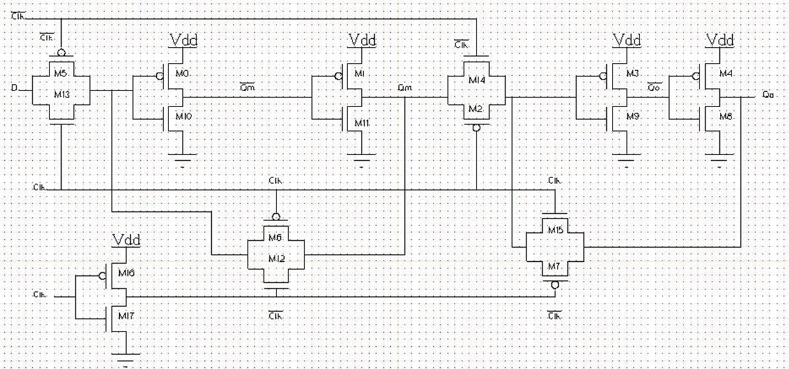
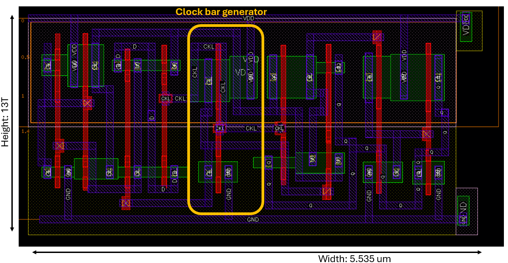
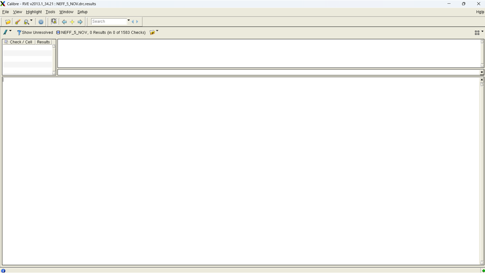
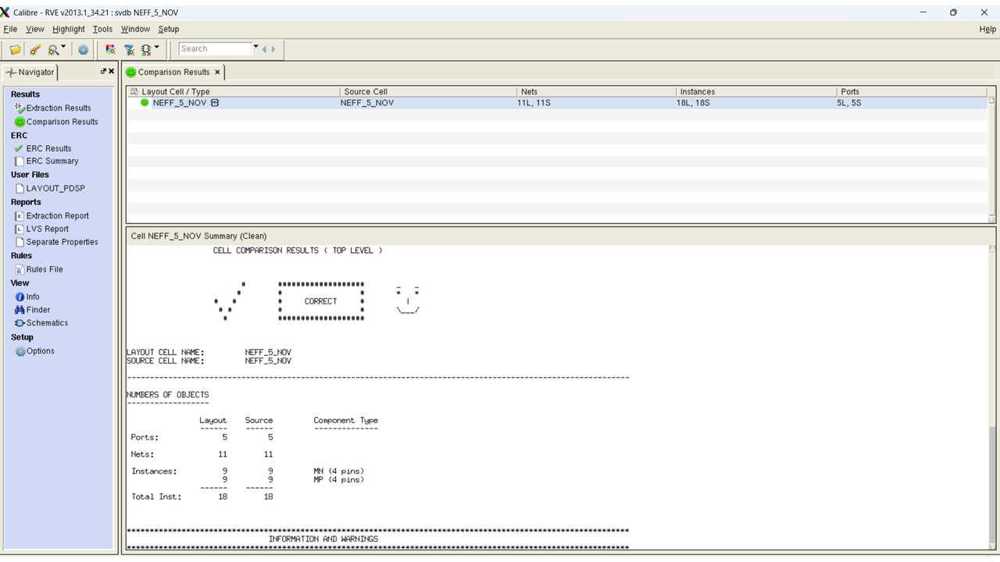
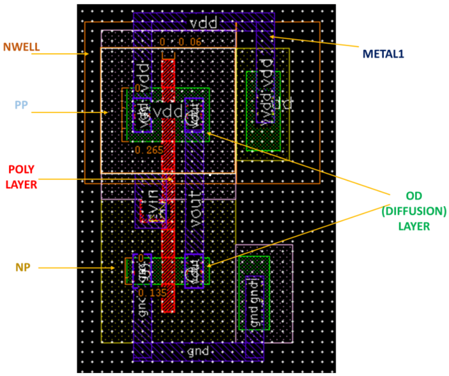
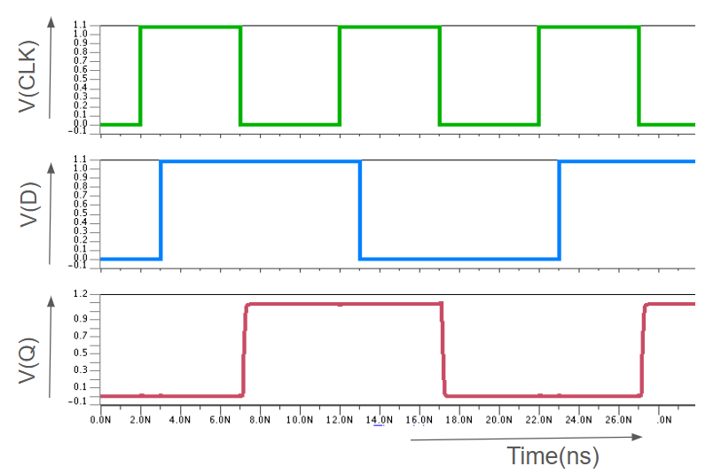
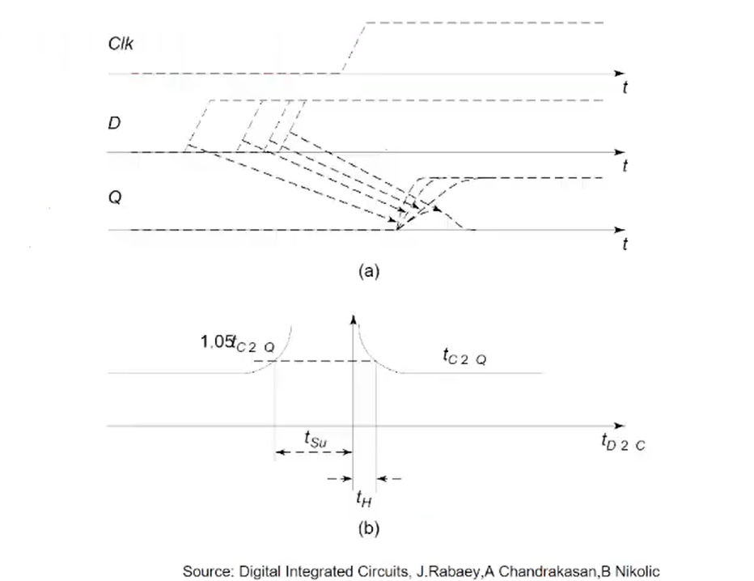

# Design and Physical Optimization of a Negative Edge-Triggered D Flip-Flop in 65nm CMOS

## 1. Abstract
This report presents the implementation of a Negative Edge-Triggered Master-Slave D Flip-Flop (DFF) utilizing a Transmission Gate (TG) architecture. The design was characterized using CMOS065 technology in Cadence Virtuoso and simulated via Siemens Eldo. The primary objective was to achieve a compact standard cell footprint (13T height) while ensuring timing robustness. Through five iterations of physical optimization, the design achieved a final area of $14.39\mu m^2$, utilizing only the Metal 1 (M1) layer to minimize fabrication mask costs and parasitic overhead.

## 2. Circuit Architecture and Device Sizing
The architecture utilizes a Master-Slave configuration to eliminate transparency issues and to save area. High-speed performance was prioritized by targeting a propagation delay ($T_{pd}$) of under 200ps.

### 2.1 Sizing Methodology
To minimize silicon area, internal logic gates were maintained at near-minimum feature sizes. However, sensitivity analysis and literature review confirmed that output-stage transistors have the most significant impact on reducing $T_{cq}$ delay. Consequently, the output drivers (M4/M8) were upsized to $0.6\mu m$ and $0.3\mu m$ respectively to drive capacitive loads effectively.

### 2.2 Transistor Sizing Specifications

| Transistor Type | Width ($W$) | Transistor Names |
| :--- | :--- | :--- |
| **PMOS** | 0.6 µm | M4 |
| | 0.54 µm | XM16, XM3, XM2, XM1 |
| | 0.27 µm | XM0 |
| | 0.135 µm | XM7, XM6, XM5 |
| **NMOS** | 0.3 µm | M8 |
| | 0.27 µm | XM14, XM9, XM11, XM17 |
| | 0.135 µm | XM15, XM13, XM12, XM10 |

> **Note:** All lengths ($L$) are assumed to be at the technology node minimum (e.g., 0.06 µm)

  

## 2. Physical Design and Iterative Optimization

### 2.1 Design Constraints
The challenge in layout was to design as per these constraints:
* Area Minimization: Fixed 13T height; optimization focused on width reduction to lower manufacturing cost.
* Layer Constraint: Restricted to Metal 1 (M1) to avoid the high cost of additional via/mask layers (Metal 2).
* Signal Integrity: Avoided polysilicon routing for the clock signal to prevent high RC-delay and signal attenuation.
* Contact Optimization: Redundant contacts were removed to reduce parasitic capacitance ($C_{para}$) and prevent routing blockages.

### 2.2 Iterative Refinement Process
* Iteration 1: Initial functional layout; utilized M2 and Polysilicon routing.
* Iteration 2: Removal of redundant contacts to improve yield and reduce capacitance.
* Iteration 3: Migration to a single-metal (M1) routing strategy.
* Iteration 4: Clock-bar inverter placed at the cell boundary; identified as a bottleneck due to long signal paths.
* Iteration 5 (Final): Relocated the clock-bar inverter to the center of the cell. This strategic placement reduced routing congestion and resulted in an 18% area saving.

<em>Figure 1: Evolution from initial to Final optimized 13T layout.</em>

The final optimized layout (Iteration 5) achieved the following specifications:
* Dimensions: 5.535µm * 2.6µm  
* Total Effective Area: 14.39µ $m^2$

### 2.3 Physical Verification (DRC & LVS)
To ensure the design is ready for fabrication, the layout was subjected to industry-standard verification suites:

1. Design Rule Check (DRC): Verified that all geometric dimensions and spacings comply with the specific technology node constraints.
2. Layout vs. Schematic (LVS): Extracted netlists from the layout were compared against the original schematic. The design achieved a "CORRECT" status, confirming 1:1 topological correspondence.

  
Figure: Physical verification reports confirming DRC/LVS compliance.

### 2.4 Layer Composition and Device Construction
The layout integrates multiple process layers to form the CMOS logic, as shown in the figure below, an expanded view of a cell (one inverter):
1. Active Regions: PMOS devices are constructed using P-Plus (PP) active implants enclosed within an N-Well, while NMOS devices utilize N-Plus (NP) implants.
2. Gate Formation: Transistors are defined by the intersection of the active regions and the Polysilicon layer
3. Latch-up Mitigation: To prevent parasitic thyristor action (latch-up), substrate and well contacts (M1-NW and PTAP) are strategically placed to provide low-resistance paths to VDD and GND.

  

## 3. Verification and Characterization
The functionality of FF is achieved, as proved by the waveform below.

   
  <em>
    Figure: Output waveforms</em>

### 3.1 Timing Estimation Methodology
Setup and Hold times were estimated by varying the Data ($D$) transition relative to the Clock ($CLK$) falling edge. The 5% Delay Degradation Method was utilized: as the data edge approaches the clock edge, $T_{cq}$ begins to rise; the point where $T_{cq}$ increases by 5% from its nominal value is defined as the timing constraint.

  

### 3.2 Performance Summary (Worst Case PVT)
| Parameter | worst Corner Case | Pre-Layout | Post-Layout |
| :--- | :--- | :--- | :--- |
| **Clock-to-Q Delay** | SS, 1.08V, 125°C | 178ps | 199ps |
| **Setup Time** | SS, 1.08V, 125°C | 34ps | 59ps |
| **Hold Time** | FF, 1.32V, -40°C | 14ps | 29ps |
| **Dynamic Power** | FF, 1.32V, -40°C | 3.192uW | 3.573uW |
| **Leakage Power** | FF, 1.32V, 125°C | 0.016uW | 0.037uW |

### 3.3 Statistical Robustness (Monte Carlo) ( Pre vs Post-Layout)
A 100-point Monte Carlo analysis was executed to evaluate sensitivity to process variations.
| Parameters | Mean (Pre) | Mean (Post) | Std. Deviation (Pre) | Std. Deviation (Post) |
| :--- | :--- | :--- | :--- | :--- |
| **Clock to Q delay** | 175ps | 189ps | 3.85ps | 6.96ps |
| **Setup Time** | 31ps | 49ps | 3.23ps | 9.56ps |
| **Hold Time** | 13ps | 25ps | 1.21ps | 4.45ps |

## 4. Final Standard Cell Performance, Power, and Area (PPA) Results
The table below summarizes the simulation results for the designed cell, highlighting the trade-offs between timing, power consumption, and physical area.

| Category | Parameter | Value | Unit |
| :--- | :--- | :--- | :--- |
| **Power** | Dynamic Power | 3.573 | μW |
| | Leakage Power | 0.037 | μW |
| **Performance** | Setup Time ($T_{setup}$) | 59 | ps |
| | Hold Time ($T_{hold}$) | 34 | ps |
| | Clock-to-Q Delay ($T_{cq}$) | 199 | ps |
| **Area** | Total Area | 14.39 | μm² |

## 5. Key Learnings and Design Guidelines
* I/O Pin Accessibility: For standard cell layouts, I/O pins should span at least two M3 tracks. This ensures the router has multiple access points, significantly improving routability in dense top-level designs.
* Clock Distribution: Centralizing clock buffers within the cell significantly reduces the standard deviation of local skews and saves horizontal routing resources.
* Latch-up Prevention: Robust substrate/well tapping (PTAP/NTAP) is mandatory to prevent parasitic latch-up in 65nm nodes.

References: 
1. H. Kumar, A. Kumar and A. Islam, "Comparative analysis of D flip-flops in terms of delay and its variability," 2015 4th International Conference on Reliability, Infocom Technologies and Optimization (ICRITO)(Trends and Future Directions), Noida, India, 2015, pp. 1-6, doi: 10.1109/ICRITO.2015.7359339
2. N. H. E. Weste and D. M. Harris, CMOS VLSI Design: A Circuits and Systems Perspective, 4th ed. Boston, MA, USA: Addison-Wesley, 2011.
3. J. M. Rabaey, A. P. Chandrakasan, and B. Nikolić, Digital Integrated Circuits: A Design Perspective, 2nd ed. Upper Saddle River, NJ, USA: Prentice Hall, 2003.
4. https://youtube.com/playlist?list=PLAHCLYSq3g_gz5ZyNlrCnnWgWWxQLeZZR&si=GfiJhqpZH2RhUut5

---
Course Project of DVD(Digital VLSI Design) Course
* **Instructor:** Prof. Anuj Grover, Indraprastha Institute of Information Technology Delhi (IIIT-D)
