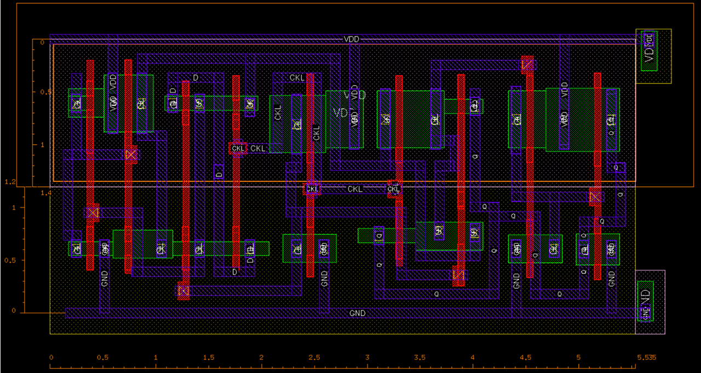

# Negative Edge-Triggered Master-Slave Flip-Flop Design

This repository contains the design, layout, and performance analysis of a **Negative Edge-Triggered D Flip-Flop** using a Master-Slave configuration with transmission gates.

## Schematic and Sizing
Transistors were sized to have delays under 200ps.
### Transistor Sizing Specifications

| Transistor Type | Width ($W$) | Transistor Names |
| :--- | :--- | :--- |
| **PMOS** | 0.6 µm | M4 |
| | 0.54 µm | XM16, XM3, XM2, XM1 |
| | 0.27 µm | XM0 |
| | 0.135 µm | XM7, XM6, XM5 |
| **NMOS** | 0.3 µm | M8 |
| | 0.27 µm | XM14, XM9, XM11, XM17 |
| | 0.135 µm | XM15, XM13, XM12, XM10 |

> **Note:** All lengths ($L$) are assumed to be at the technology node minimum (e.g., 0.06 µm) unless otherwise specified.

  

## Layout & Physical Design
The layout was optimized through 5 iterations in order to reduce area consumed. It was designed as per standard cell design rules

* **Final Area:** $14.39\mu m^2$ ($5.535\mu m \times 2.6\mu m$)
* **Verification:** The layout passed **DRC** and **LVS** with a "CORRECT" status

* 

  

  

  

## Verification Plan & Stimuli

To verify the design's performance and functionality, the following verification plan was implemented using specific pre-conditions and stimuli:

| Parameters | Pre-Conditions | Stimuli |
| :--- | :--- | :--- |
| **Clock to Q delay** | Data is stable ($D=1$), clock is high  | Apply Clock $= 0$  |
| **Setup Time** | Clock is high, about to transition low  | Change Data input before the clock edge; measured when Clk-to-Q delay varies by ~5%  |
| **Hold Time** | Clock has just transitioned from high to low  | Change Data input after the clock edge; measured when Clk-to-Q delay varies by ~5%  |

  

## 📊 Performance Analysis
Performance was evaluated under various PVT (Process, Voltage, Temperature) corners

| Parameter | worst Corner Case | Pre-Layout | Post-Layout |
| :--- | :--- | :--- | :--- |
| **Clock-to-Q Delay** | SS, 1.08V, 125°C | 178ps | 199ps |
| **Setup Time** | SS, 1.08V, 125°C | 34ps | 59ps |
| **Hold Time** | FF, 1.32V, -40°C | 14ps | 29ps |
| **Dynamic Power** | FF, 1.32V, -40°C | 3.192uW | 3.573uW |
| **Leakage Power** | FF, 1.32V, 125°C | 0.016uW | 0.037uW |

### Monte Carlo Simulations Analysis ( Pre vs Post-Layout)
To account for process variations, 1000-point Monte Carlo simulations were conducted
| Parameters | Mean (Pre) | Mean (Post) | Std. Deviation (Pre) | Std. Deviation (Post) |
| :--- | :--- | :--- | :--- | :--- |
| **Clock to Q delay** | 175ps | 189ps | 3.85ps | 6.96ps |
| **Setup Time** | 31ps | 49ps | 3.23ps | 9.56ps |
| **Hold Time** | 13ps | 25ps | 1.21ps | 4.45ps |

References: 
1. H. Kumar, A. Kumar and A. Islam, "Comparative analysis of D flip-flops in terms of delay and its variability," 2015 4th International Conference on Reliability, Infocom Technologies and Optimization (ICRITO)(Trends and Future Directions), Noida, India, 2015, pp. 1-6, doi: 10.1109/ICRITO.2015.7359339
2. N. H. E. Weste and D. M. Harris, CMOS VLSI Design: A Circuits and Systems Perspective, 4th ed. Boston, MA, USA: Addison-Wesley, 2011.
3. https://youtube.com/playlist?list=PLAHCLYSq3g_gz5ZyNlrCnnWgWWxQLeZZR&si=GfiJhqpZH2RhUut5

---
Course Project of DVD(Digital VLSI Design) Course
* **Instructor:** Prof. Anuj Grover, Indraprastha Institute of Information Technology Delhi (IIIT-D)
